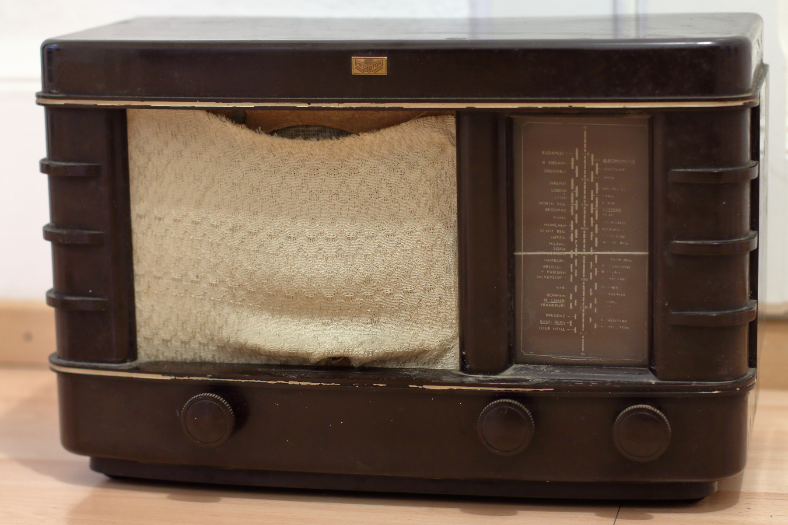
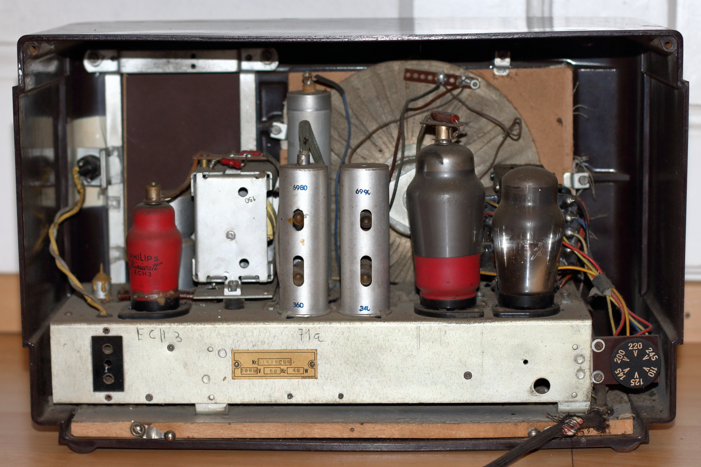
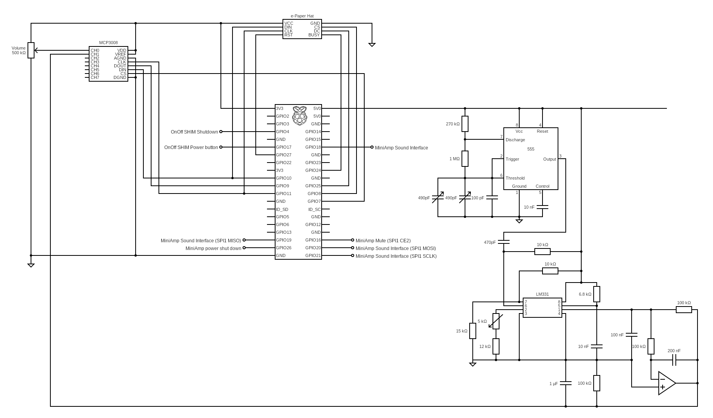

# Vintage M40 Radio Music Player
Repo of documents and code used for the Mediator M40 Radio upgrade

## Mediator M40 Radio



The [Mediator M40](https://www.radiomuseum.org/r/mediator_40a.html) radio is a tube radio manufactured in the early 1940s by the Swiss Company [Mediator](https://www.radiomuseum.org/dsp_hersteller_detail.cfm?company_id=140) located in La Chaux-de-Fonds. The radio is identical to the [Philips Philette 206 A](https://www.radiomuseum.org/r/philips_philette_206a.html) made by Philips Switzerland. However it differs from the [Philips 206 A](https://www.radiomuseum.org/r/philips_206a206.html) produced in the Netherlands as it only has MW. 
My radio has a control mark sticker from the Swiss telecom PTT from 1941 on the back. 

- [Service Manual of the Philips 206 A 'Junior'](doc/Phillips_206_A_Junior.pdf)

## Upgrade
The radio is upgraded to a Webradio and Music Player using a [Raspberry Pi Zero W](https://www.raspberrypi.org/products/raspberry-pi-zero-w/) and a [HifiBerry MiniAMP](https://www.hifiberry.com/shop/boards/miniamp/). The electrical components of the radio are very old and even if it seems that most of them still work, I decided to leave them in as is, but not to use them in the circuit. However I wanted to reuse the speaker and the control knobs including the corresponding potentiometer and the variable capacitor.

## OS
The Linux based [volumio](https://volumio.org/) is used as OS and music player software, as it has nice features and works on the Raspberry Pi Zero. The [HifiBerryOS](https://www.hifiberry.com/hifiberryos/) does not work well on Pi Zero according their website. 

### Installation
[Download](https://volumio.org/get-started/) and install volumio according the documentation. 

___Note___: When using the HifiBerry MiniAMP _HifiBerry DAC_ need to be selected as Playback Output Device. However make sure that _I2S DAC_ is not enabled.

## User Control

### Circuit


### PowerSwitch
The original _'Waverange'_ switch of the radio is used as power switch. To allow a proper shutdown the [OnOff SHIM](https://shop.pimoroni.com/products/onoff-shim) by pimoroni is used. The OnOff SHIM is usually used with a button and not a switch, therefore I had to modify the clean-shutdown code to shutdwon, when the trigger is pulled high (Pull-Up) and not low.


### Volume
The original _'volume control knob'_ is used for volume control. The potentiometer is connected to an [MCP3008](doc/MCP3008.pdf) A/D converter (_see circuit above_). The _MCP3008_ is connected to the Raspberry Pi using the SPI interface.

####  Enable SPI
To enable hardware SPI on the Pi we need to make a modification to a system file :

```bash
sudo nano /boot/config.txt
```
Add the following line:
```bash
dtparam=spi=on
```

__Checking if SPI is enabled__


```bash
lsmod | grep spi_
```

You should see `spi_bcm2835` listed in the output.

### Volume Control Daemon
 A [volume-control](src/volume-control) daemon is installed on the Pi ([volume_daemon_ws.py](src/analog_input/volume_daemon_ws.py)). volume-control interacts with [WebSocket API](https://developers.volumio.com/api/websocket-api#volume) of volumio to set the volume according the value read from the A/D converter.

 #### Install Dependencies
```bash
sudo apt-get update
sudo apt-get install python3 python3-pip
sudo apt-get install python3-pil
sudo apt-get install python3-numpy
sudo pip3 install RPi.GPIO
sudo pip3 install spidev 
sudo pip3 pip install python-socketio[client]==4.6.1 aiohttp
```

#### Run at startup
Use systemd to start volume-control as service:

- Copy the `analog_input` folder into the volumio home directory on the Pi.
- Copy the unit file [volume-control.service](volume-control.service) into `/lib/systemd/system/` on the Pi.
- The permission on the unit file needs to be set to 644:
  `sudo chmod 644 /lib/systemd/system/volume-control.service`
- Configure systemd: 
  ```
  sudo systemctl daemon-reload
  sudo systemctl enable volume-control.service
  ```
- Reboot or start the service with:
  `sudo systemctl start volume-control`

### Playlist/Radio Station Control
For Playlist/Radio Station selection the original '_radio station control knob'_ is used. The  knob turns a [mechanically controlled capacitor](https://en.wikipedia.org/wiki/Variable_capacitor#Mechanically_controlled_capacitance). In order to 'measure' the capacitance the two separate _variable capacitor_ are used to control the frequency of a [ICM7555](doc/ICM7555.pdf) timer in _monostable operation_ and then use an [LM231](doc/lm231.pdf) _Voltage-to-Frequency Converter_ to measure the frequency (_see circuit above_). As OpAmp a [MC1741CP](doc/MC1741.pdf) is used.

Acording the datasheet, the resulting frequency of the _ICM7555_ can be calculated as: $f = \frac{1.38}{(R_A + 2R_B)C}$

Therefore we have a frequency range of about:

$`\frac{1.38}{(270k\Omega + 2 * 1M\Omega)* 1080pF} = 563Hz`$ to $`\frac{1.38}{(270k\Omega + 2 * 1M\Omega)* 100pF} = 6,079kHz`$